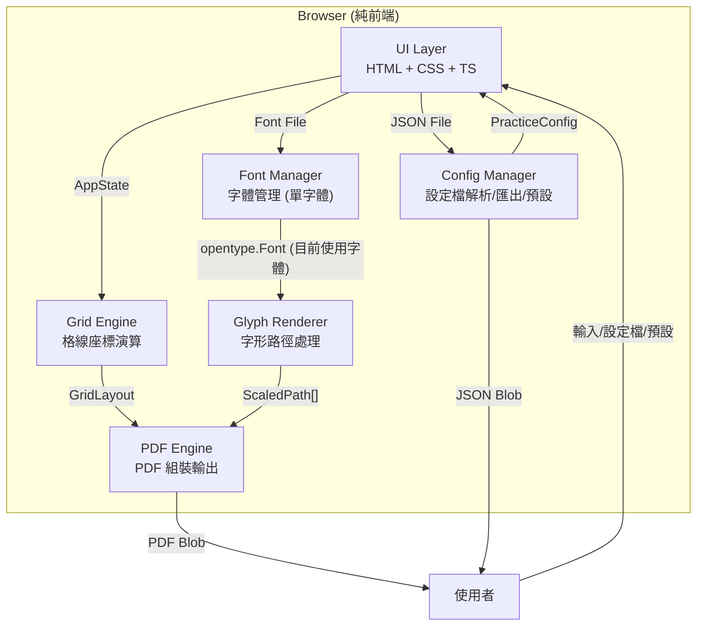
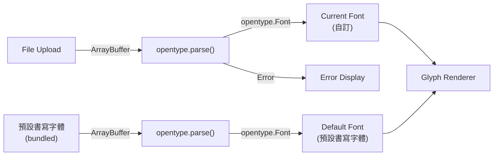
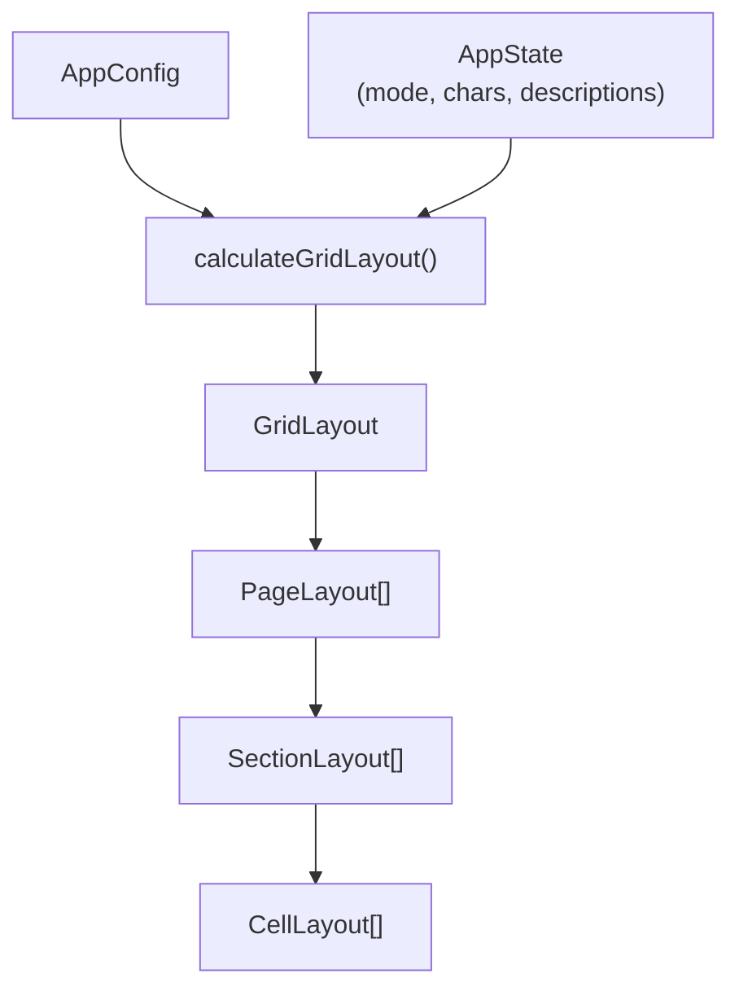
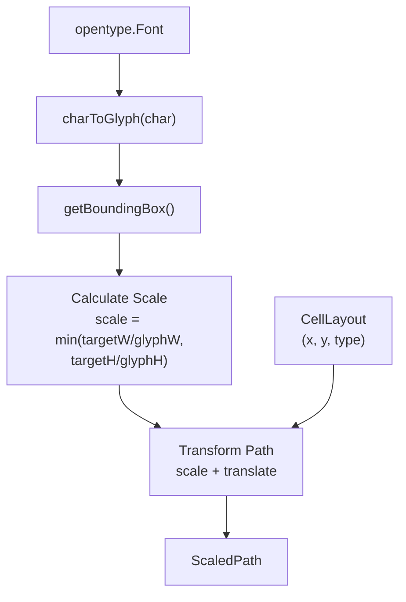
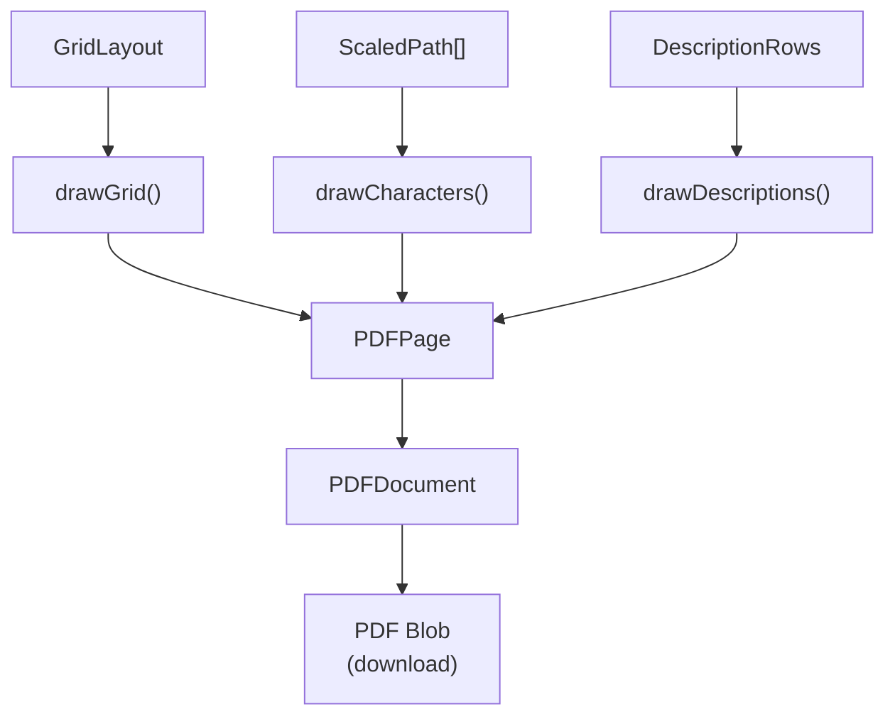
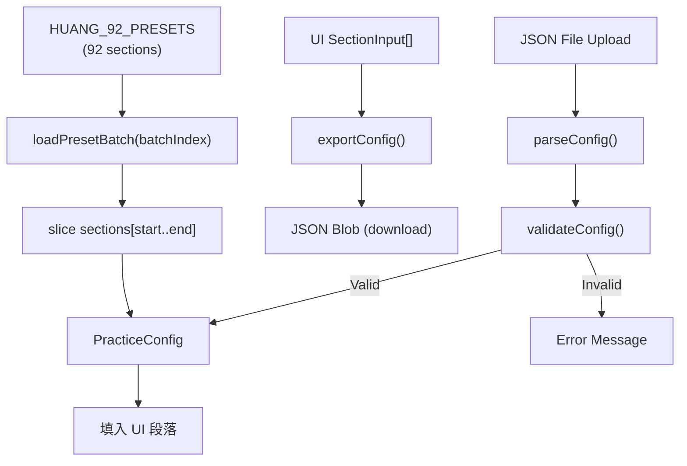
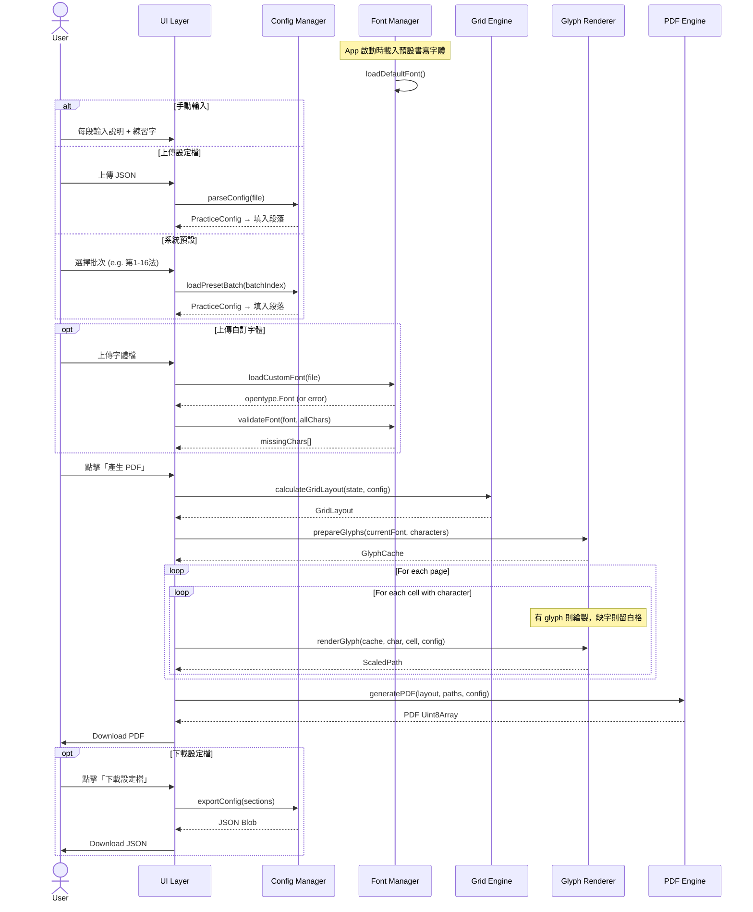
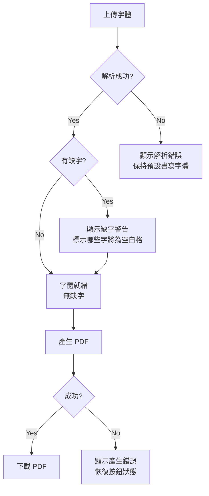

# 04 — 技術架構設計 (Technical Architecture Design)

> **文件版本**: v2.0  
> **建立日期**: 2026-02-27  
> **狀態**: Draft  
> **對應流程**: Phase 2 — Architecture & Planning  
> **鐵律**: 資料結構優先，消除特殊情況

---

## 1. 系統總覽

### 1.1 架構圖



### 1.2 模組職責

```
┌──────────────────────────────────────────────────────────────────────┐
│ 模組              │ 職責                             │ 依賴           │
├──────────────────────────────────────────────────────────────────────┤
│ UI Layer          │ 使用者互動、狀態管理、段落編輯    │ 無外部依賴     │
│ Config Manager    │ JSON 設定檔解析/匯出、系統預設管理│ 無外部依賴     │
│ Font Manager      │ 字體上傳、解析、快取、雙字體管理  │ opentype.js    │
│ Grid Engine       │ 格線座標計算、字元定位、字池處理  │ 無外部依賴     │
│ Glyph Renderer    │ 路徑提取、BBox、縮放              │ opentype.js    │
│ PDF Engine        │ 格線繪製、路徑繪製                │ pdf-lib        │
└──────────────────────────────────────────────────────────────────────┘
```

---

## 2. 核心資料結構

### 2.1 設計哲學

> "Bad programmers worry about the code. Good programmers worry about data structures."

所有資料結構設計遵循：
- 消除特殊情況：兩種模式 (有/無說明) 用同一資料結構表達
- 座標系統一致：全部使用 mm 為單位，PDF 輸出時轉換為 points

### 2.2 PracticeConfig (練習設定 — 核心資料模型)

段落化的字池結構，統一描述手動輸入、設定檔上傳、系統預設三種來源：

```typescript
interface PracticeConfig {
  sections: SectionConfig[]
}

interface SectionConfig {
  description: string      // 書法結構說明 (可為空字串)
  characters: string[]     // 字池 (可 >4 個字)
}
```

### 2.3 AppConfig (應用設定 — 常數)

```typescript
interface AppConfig {
  paper: {
    width: 210           // mm (A4)
    height: 297          // mm (A4)
  }
  grid: {
    fineCols: 48         // fine grid 欄數
    fineRows: 72         // fine grid 列數
    cellSize: 3.7        // mm, fine cell 邊長 (正方形)
    charCellSize: 3      // fine cells per char cell (3x3)
  }
  layout: {
    charsPerGroup: 4     // 每字組 4 欄 (2 描寫 + 2 臨摹)
    groupsPerRow: 4      // 每行 4 個字組
    rowsPerSection: 6    // 每段 6 字行
    sectionsPerPage: 4   // 每頁 4 段
    guideCols: 2         // 描寫欄數
    blankCols: 2         // 臨摹欄數
    maxCharsPerSection: 4  // 有說明模式每段最多取 4 字
  }
  rendering: {
    fillRatio: 0.90              // 字元填充比例
    modelCharOpacity: 1.0        // 範字 opacity
    guideCharOpacity: 0.25       // 引導字 opacity
    fineGridOpacity: 0.10        // fine grid opacity
    cellGridOpacity: 0.40        // 字格格線 opacity
    sectionDividerOpacity: 0.60  // 段落分隔線 opacity
    fineGridLineWidth: 0.1       // pt
    cellGridLineWidth: 0.3       // pt
    sectionDividerLineWidth: 0.5 // pt
  }
  // 衍生常數 (computed from above)
  charCellSizeMm: 11.1    // 3.7 * 3 = 11.1mm
  gridWidth: 177.6         // 3.7 * 48 = 177.6mm
  gridHeight: 266.4        // 3.7 * 72 = 266.4mm
  marginX: 16.2            // (210 - 177.6) / 2
  marginY: 15.3            // (297 - 266.4) / 2
  charsPerPage: 16         // 4 groups x 4 sections
}
```

### 2.4 AppState (應用狀態 — 可變)

```typescript
interface AppState {
  mode: 'no-description' | 'with-description'
  contentSource: 'manual' | 'upload' | 'preset'
  
  // 核心內容 (來自手動/設定檔/預設，三者互通)
  sections: SectionInput[]
  
  // 字體管理 (單字體 + 缺字清單)
  fontSource: 'default' | 'custom'
  customFontFile: File | null
  parsedFont: opentype.Font | null       // 目前使用字體 (預設或使用者上傳)
  missingChars: Map<string, string[]>    // sectionIndex → 缺字清單
  
  // UI 狀態
  isGenerating: boolean
  progress: number          // 0-100
  error: string | null
}

interface SectionInput {
  description: string     // 說明文字
  characters: string      // 過濾後的中文字串 (字池)
}
```

### 2.5 GridLayout (格線佈局 — 計算產出)

```typescript
interface GridLayout {
  pages: PageLayout[]
}

interface PageLayout {
  pageIndex: number
  sections: SectionLayout[]
}

interface SectionLayout {
  sectionIndex: number          // 0-3
  originY: number               // mm, section 起始 Y 座標
  
  // 說明列 (兩種模式統一結構)
  descriptionRow: DescriptionRow | null
  
  // 練習列
  practiceRows: PracticeRow[]   // 長度 = 6 (無說明) 或 5 (有說明)
  
  // 字組
  charGroups: CharGroupLayout[] // 長度 = 4
}

interface DescriptionRow {
  y: number           // mm
  width: number       // mm (= gridWidth)
  height: number      // mm (= charCellSizeMm)
  text: string
}

interface CharGroupLayout {
  groupIndex: number  // 0-3
  character: string | null   // null = 空白組
  originX: number     // mm
  cells: CellLayout[]
}

interface CellLayout {
  row: number
  col: number         // 0-3 (within group)
  x: number           // mm (cell 左上角)
  y: number           // mm (cell 左上角)
  type: 'model' | 'guide' | 'blank'
}

interface PracticeRow {
  rowIndex: number
  y: number           // mm
}
```

### 2.6 ScaledPath (縮放後路徑 — Glyph Renderer 產出)

```typescript
interface ScaledPath {
  character: string
  commands: PathCommand[]   // 已做 scale + translate 的路徑
  fillColor: string
  opacity: number
}

type PathCommand =
  | { type: 'M'; x: number; y: number }
  | { type: 'L'; x: number; y: number }
  | { type: 'C'; x1: number; y1: number; x2: number; y2: number; x: number; y: number }
  | { type: 'Z' }
```

---

## 3. 模組詳細設計

### 3.1 Font Manager (單字體 + 缺字警告)



**核心職責:**

```
FontManager {
  loadDefaultFont(): Promise<opentype.Font>         // 載入預設書寫字體 (app 啟動時)
  loadCustomFont(file: File): Promise<opentype.Font> // 載入使用者字體
  validateFont(font: opentype.Font, characters: string[]): string[]  // 回傳缺字清單 (僅標記，不替代)
  getCurrentFont(): opentype.Font                   // 取得目前使用字體 (自訂或預設)
}
```

**字體解析與缺字流程:**
1. App 啟動時載入預設書寫字體，作為初始 Current Font
2. 使用者上傳字體 → 解析為新的 Current Font
3. 驗證字元覆蓋 → 回傳缺字清單，僅用於顯示警告，不進行字體替代
4. Glyph Renderer 在繪製時若發現當前字體缺 glyph，直接產生留白格 (不呼叫任何 fallback 邏輯)

### 3.2 Grid Engine



**核心職責:**

```
GridEngine {
  calculateGridLayout(state: AppState, config: AppConfig): GridLayout
}
```

**計算邏輯 (兩種模式統一處理):**

```
calculateGridLayout(state, config):
  // 第一步: 依模式解析字池為「待渲染字元清單」
  renderChars = resolveCharacters(state)
  
  // 第二步: 分頁 + 分段 + 定位
  pages = []
  
  if state.mode == 'with-description':
    // 有說明: 保持段落結構 (每段最多 4 字)
    sectionIndex = 0
    while sectionIndex < renderChars.sections.length:
      sections = []
      for i in 0..3:
        if sectionIndex >= renderChars.sections.length:
          sections.push(emptySection(i))  // 空白段落 (僅格線)
          continue
        sec = renderChars.sections[sectionIndex++]
        descRow = { y: ..., text: sec.description }
        charGroups = buildCharGroups(sec.characters, 5)  // 5 practice rows
        sections.push({ descriptionRow: descRow, charGroups })
      pages.push({ sections })
  
  else:
    // 無說明: 扁平化字池, 每 16 字一頁
    flatChars = renderChars.flatCharacters
    charIndex = 0
    pageCount = max(1, ceil(flatChars.length / config.charsPerPage))
    for each page:
      sections = []
      for each section in 0..3:
        charGroups = []
        for each group in 0..3:
          char = flatChars[charIndex++] or null
          charGroups.push(buildCharGroup(char, 6))  // 6 practice rows
        sections.push({ descriptionRow: null, charGroups })
      pages.push({ sections })
  
  return { pages }


resolveCharacters(state):
  if state.mode == 'with-description':
    return {
      sections: state.sections.map(sec => ({
        description: sec.description,
        characters: sec.characters.length > 4
          ? randomPick(sec.characters, 4)  // 隨機挑 4 字
          : sec.characters
      }))
    }
  else:
    return {
      flatCharacters: state.sections.flatMap(sec => sec.characters)
    }
```

**座標計算公式:**

```
cellX(groupIndex, colInGroup) =
  marginX + groupIndex * charsPerGroup * charCellSizeMm + colInGroup * charCellSizeMm

cellY(sectionIndex, rowInSection, hasDescription) =
  marginY + sectionIndex * rowsPerSection * charCellSizeMm
         + (hasDescription ? charCellSizeMm : 0)   // 跳過說明列
         + rowInSection * charCellSizeMm
```

### 3.3 Glyph Renderer



**核心職責:**

```
GlyphRenderer {
  // 預先解析字體中的所有需要字元 (快取)
  prepareGlyphs(font: opentype.Font, characters: string[]): GlyphCache
  
  // 產生特定 cell 的縮放路徑
  renderGlyph(
    cache: GlyphCache,
    character: string,
    cell: CellLayout,
    config: AppConfig
  ): ScaledPath
}
```

**路徑變換演算法:**

```
renderGlyph(cache, char, cell, config):
  glyph = cache[char]
  bbox = glyph.inkBBox          // 實際筆劃邊界
  
  glyphW = bbox.x2 - bbox.x1
  glyphH = bbox.y2 - bbox.y1
  
  targetSize = config.charCellSizeMm * config.rendering.fillRatio
  scale = min(targetSize / glyphW, targetSize / glyphH)
  
  scaledW = glyphW * scale
  scaledH = glyphH * scale
  
  // 置中
  offsetX = cell.x + (config.charCellSizeMm - scaledW) / 2
  offsetY = cell.y + (config.charCellSizeMm - scaledH) / 2
  
  // 變換路徑
  commands = glyph.path.commands.map(cmd => transform(cmd, bbox, scale, offsetX, offsetY))
  
  // 設定顏色/透明度
  opacity = cell.type == 'model' ? config.rendering.modelCharOpacity
                                  : config.rendering.guideCharOpacity
  
  return { character: char, commands, fillColor: '#000000', opacity }
```

**Quadratic → Cubic 轉換:**

```
convertQ2C(px, py, cx, cy, x, y):
  return {
    type: 'C',
    x1: px + 2/3 * (cx - px),
    y1: py + 2/3 * (cy - py),
    x2: x  + 2/3 * (cx - x),
    y2: y  + 2/3 * (cy - y),
    x, y
  }
```

### 3.4 PDF Engine



**核心職責:**

```
PDFEngine {
  generatePDF(
    layout: GridLayout,
    paths: ScaledPath[][],     // per page, per cell
    config: AppConfig,
    font?: opentype.Font       // 說明列用
  ): Promise<Uint8Array>
}
```

**繪製順序 (每頁):**

```
1. drawFineGrid(page, config)         // Layer 1: 淺色 72x48 格線
2. drawCellGrid(page, config)         // Layer 2: 中色字格邊框
3. drawSectionDividers(page, config)  // Layer 3: 段落分隔線
4. drawDescriptions(page, sections)   // Layer 4: 說明文字
5. drawGlyphPaths(page, paths)        // Layer 5+6: 引導字 + 範字
```

**mm → PDF points 轉換:**

```
MM_TO_PT = 72 / 25.4  // 1mm = 2.8346pt

toPoints(mm: number): number = mm * MM_TO_PT

// PDF 座標系 Y 軸翻轉
toPdfY(mm: number, pageHeight: number): number =
  pageHeight - mm * MM_TO_PT
```

### 3.5 Config Manager



**核心職責:**

```
ConfigManager {
  // 解析上傳的 JSON 設定檔
  parseConfig(file: File): Promise<PracticeConfig>
  
  // 驗證 PracticeConfig 結構合法性
  validateConfig(data: unknown): PracticeConfig | Error
  
  // 匯出目前 UI 狀態為 JSON
  exportConfig(sections: SectionInput[]): Blob
  
  // 取得批次列表 (7 批次 + 全部)
  getPresetBatches(): PresetBatch[]
  
  // 載入特定批次的預設段落
  loadPresetBatch(batchIndex: number | 'all'): PracticeConfig
}

interface PresetBatch {
  index: number          // 0-5 (批次索引), 或 -1 代表全部
  label: string          // e.g. "第 1-16 法"
  startRule: number      // e.g. 1
  endRule: number        // e.g. 16
  sectionCount: number   // 該批次段落數 (16 或 12)
  pageCount: number      // 有說明模式頁數 (4 或 3)
}
```

**黃自元間架結構九十二法 (內建資料):**

```typescript
// 完整 92 法資料 (由使用者提供 JSON，嵌入為常數)
const HUANG_92_PRESETS: PracticeConfig = {
  sections: [
    {
      description: "01、天覆者凡畫皆冒於其下：上面是寶蓋的字，其餘筆畫應冒於其下。",
      characters: ["寅", "宙", "守", "宿"]
    },
    {
      description: "02、地載者有畫皆托於其上：...",
      characters: ["至", "盆", "盤", "鹽"]
    },
    // ... 共 92 個段落
  ]
}

// 批次定義 (每 16 法一批)
const PRESET_BATCHES: PresetBatch[] = [
  { index: 0, label: "第 1-16 法",  startRule: 1,  endRule: 16, sectionCount: 16, pageCount: 4 },
  { index: 1, label: "第 17-32 法", startRule: 17, endRule: 32, sectionCount: 16, pageCount: 4 },
  { index: 2, label: "第 33-48 法", startRule: 33, endRule: 48, sectionCount: 16, pageCount: 4 },
  { index: 3, label: "第 49-64 法", startRule: 49, endRule: 64, sectionCount: 16, pageCount: 4 },
  { index: 4, label: "第 65-80 法", startRule: 65, endRule: 80, sectionCount: 16, pageCount: 4 },
  { index: 5, label: "第 81-92 法", startRule: 81, endRule: 92, sectionCount: 12, pageCount: 3 },
]

// loadPresetBatch 實作:
loadPresetBatch(batchIndex: number | 'all'):
  if batchIndex == 'all':
    return HUANG_92_PRESETS                          // 全部 92 段
  batch = PRESET_BATCHES[batchIndex]
  start = batch.startRule - 1                        // 0-based index
  end = batch.endRule
  return { sections: HUANG_92_PRESETS.sections.slice(start, end) }
```

---

## 4. 資料流圖

### 4.1 完整資料流



### 4.2 錯誤流



---

## 5. 檔案結構

```
pen-practice/
├── index.html                  # 單頁入口
├── src/
│   ├── main.ts                 # 應用入口，初始化 (含載入預設書寫字體)
│   ├── types.ts                # 所有 TypeScript 型別定義
│   ├── config.ts               # AppConfig 常數
│   ├── state.ts                # AppState 狀態管理
│   ├── ui/
│   │   ├── app.ts              # 主要 UI 組裝
│   │   ├── mode-selector.ts    # 模式選擇元件
│   │   ├── content-source.ts   # 內容來源切換 (手動/上傳/預設)
│   │   ├── section-editor.ts   # 段落編輯元件 (說明 + 練習字)
│   │   ├── font-uploader.ts    # 字體上傳元件
│   │   ├── action-buttons.ts   # 產生 PDF + 下載設定檔按鈕
│   │   └── preset-selector.ts  # 系統預設選擇器
│   ├── engine/
│   │   ├── grid-engine.ts      # Grid Engine (含字池處理)
│   │   ├── glyph-renderer.ts   # Glyph Renderer
│   │   ├── pdf-engine.ts       # PDF Engine
│   │   ├── font-manager.ts     # Font Manager (單字體 + 缺字清單)
│   │   └── config-manager.ts   # Config Manager (解析/匯出/預設)
│   ├── data/
│   │   └── presets.ts          # 系統預設設定檔資料
│   └── utils/
│       ├── path-converter.ts   # opentype path → pdf-lib path 轉換
│       ├── coordinate.ts       # mm ↔ pt 座標轉換
│       ├── validators.ts       # 輸入驗證 (字元過濾、JSON 驗證)
│       └── random.ts           # 隨機挑選工具 (Fisher-Yates shuffle)
├── assets/
│   └── fonts/
│       └── default-kai.ttf     # 預設書寫用楷體 (開源授權)
├── styles/
│   └── main.css                # 樣式
├── package.json
├── tsconfig.json
└── vite.config.ts              # 建置工具 (Vite)
```

---

## 6. 技術選型

| 類別 | 選擇 | 理由 |
|------|------|------|
| 建置工具 | Vite | 快速 HMR，TypeScript 原生支援 |
| 語言 | TypeScript | 型別安全，資料結構明確 |
| UI 框架 | 無 (Vanilla TS) | 頁面極簡，無需框架複雜度 |
| 字體解析 | opentype.js | 唯一成熟的瀏覽器端 OTF/TTF 解析庫 |
| PDF 產生 | pdf-lib | 純 JS，支援向量繪製，無 DOM 依賴 |
| CSS | 原生 CSS | 元件少，不需 CSS 框架 |

**不使用前端框架的理由:**
- 整個 UI 只有 ~6 個互動元件
- 狀態極簡 (1 個 AppState 物件)
- 引入 React/Vue 的代價 > 收益
- 減少依賴，降低維護成本

---

## 7. 效能設計

### 7.1 Glyph Cache

```
每個不同字只解析一次 path，快取供重複使用:

GlyphCache = Map<string, {
  path: PathCommand[]       // 原始路徑 (font units)
  inkBBox: BBox             // Ink Bounding Box
}>

一頁 16 個不同字 → 快取 16 個 glyph
多頁共用同一個 GlyphCache
```

### 7.2 進度回報

```
PDF 產生為同步密集運算。使用 requestAnimationFrame 或
setTimeout(0) 在每頁之間讓出主執行緒，更新進度 UI:

for each page:
  drawPage(page)
  progress = (pageIndex + 1) / totalPages * 100
  await yieldToUI()    // setTimeout(0)
  updateProgress(progress)
```

---

## 8. 座標系統對照

```
┌─────────────────────────────────────────────────────┐
│ 座標系統                                              │
│                                                       │
│ 邏輯座標 (Grid Engine 輸出):                          │
│   原點: 左上角                                        │
│   單位: mm                                            │
│   X: 左→右                                           │
│   Y: 上→下                                           │
│                                                       │
│ opentype.js 座標:                                     │
│   原點: 左下角                                        │
│   單位: font units                                    │
│   X: 左→右                                           │
│   Y: 下→上                                           │
│                                                       │
│ PDF 座標 (pdf-lib):                                   │
│   原點: 左下角                                        │
│   單位: points (1pt = 1/72 inch = 0.3528mm)          │
│   X: 左→右                                           │
│   Y: 下→上                                           │
│                                                       │
│ 轉換鏈:                                              │
│   邏輯 (mm, Y↓) → PDF (pt, Y↑)                      │
│   pdfX = logicalX * MM_TO_PT                         │
│   pdfY = (paperHeight - logicalY) * MM_TO_PT         │
│                                                       │
│   opentype (units, Y↑) → PDF (pt, Y↑)               │
│   天然相容! 只需 scale + translate                     │
│                                                       │
│   但 glyph path 繪製在邏輯座標的 cell 內:             │
│   需先將邏輯 cell 位置轉為 PDF 座標,                  │
│   再將 glyph path 在 PDF 座標系中縮放定位              │
└─────────────────────────────────────────────────────┘
```
